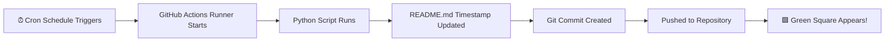

# activity-keeper

<!-- LAST_UPDATED --> Last auto-updated: `2026-04-06 10:14:36 UTC`

<div align="center">


<br/>


<br/>

> **⚠️ DISCLAIMER: This project is purely for fun and learning purposes.**
> It does **not** represent real coding activity and should **not** be used to
> mislead employers or collaborators about your actual contributions.
> Use responsibly. 😄

<br/>

</div>

---

## 🧠 What is this?

<table>
<tr>
<td>

**GreenGraph Bot** is a fun automation project that uses **GitHub Actions** and a **Python script** to make a small, harmless change to this `README.md` file on a scheduled basis — keeping the contribution graph from going completely dark.

It automatically updates a single timestamp line in this file, commits it, and pushes — which GitHub counts as a contribution. That's it. No magic, no tricks, just a tiny timestamp update running on a cron schedule.

</td>
<td>

</td>
</tr>
</table>

---

## 🗂️ Project Structure

```
📦 greengraph-bot/
├── 📄 README.md                          ← This file (gets auto-updated)
├── 🐍 update_readme.py                   ← Python script that edits README
└── 📁 .github/
    └── 📁 workflows/
        └── ⚙️  auto-commit.yml           ← GitHub Actions workflow (the engine)
```

---

## ⚙️ How It Works



<br/>

<details>
<summary><b>🔍 What exactly changes in README.md?</b></summary>
<br/>

Only **one single line** is changed on every run — a hidden HTML comment timestamp at the bottom of this file:

**Before:**
```
<!-- LAST_UPDATED --> Last auto-updated: `2026-04-01 09:00:00 UTC`
```

**After:**
```
<!-- LAST_UPDATED --> Last auto-updated: `2026-04-03 09:00:00 UTC`
```

That's it. One line. One commit. One green square. ✅

</details>

---

## 🚀 How to Turn It ON

Follow these steps to get the bot running on your own fork:

<br/>

**Step 1 — Fork or clone this repository**

```bash
git clone https://github.com/your-username/greengraph-bot.git
cd greengraph-bot
```

<br/>

**Step 2 — Enable workflow write permissions**

Go to your repo on GitHub:

```
Settings → Actions → General → Workflow Permissions
→ Select "Read and write permissions" → Save
```

<br/>

**Step 3 — Enable GitHub Actions**

```
Click the "Actions" tab in your repository
→ Click "I understand my workflows, go ahead and enable them"
```

<br/>

**Step 4 — Trigger a manual test run**

```
Actions tab → "Auto Commit to README" → "Run workflow" → Run workflow ✅
```

<br/>

**Step 5 — Verify it's working**

```
Go to your repo's Code tab
→ You should see a new commit: "🟩 Daily auto-update: YYYY-MM-DD"
→ Check your GitHub profile contribution graph 🟩
```

> ✅ After this, the bot runs **automatically** on its schedule — no further action needed!

---

## 🛑 How to Turn It OFF

There are **3 ways** to stop the bot, depending on how permanently you want to disable it:

<br/>

### Option 1 — Pause the Workflow (Easiest, Reversible)

```
Go to: Actions tab → "Auto Commit to README" (left sidebar)
→ Click the "..." (three dots) menu on the top right
→ Click "Disable workflow"
```

To re-enable: same steps → click **"Enable workflow"**

<br/>

### Option 2 — Comment Out the Cron Schedule

Edit `.github/workflows/auto-commit.yml` and comment out the schedule:

```yaml
on:
  # schedule:
  #   - cron: '0 9 */2 * *'    ← commented out = bot is paused
  workflow_dispatch:             ← manual trigger still works
```

To re-enable: just uncomment those lines.

<br/>

### Option 3 — Delete the Workflow File (Permanent)

```bash
rm .github/workflows/auto-commit.yml
git add .
git commit -m "Remove auto-commit workflow"
git push
```

> This permanently removes the automation. The bot will never run again unless you re-add the file.

---

## 🔧 Configuration

You can customize the bot's behavior by editing `.github/workflows/auto-commit.yml`:

| Setting | Location | Default | Options |
|---|---|---|---|
| Run frequency | `cron` expression | Every 2 days | See below |
| Run time | `cron` expression | 9:00 AM UTC | Any time |
| Commit author name | `user.name` | `Auto Bot` | Any name |
| Commit author email | `user.email` | your email | Must match GitHub account |

<br/>

**Common cron schedules:**

```yaml
# Every day
- cron: '0 9 * * *'

# Every 2 days (recommended)
- cron: '0 9 */2 * *'

# Every 3 days
- cron: '0 9 */3 * *'

# Weekdays only (Mon–Fri)
- cron: '0 9 * * 1-5'
```

> 🕐 Use [crontab.guru](https://crontab.guru) to build and test your own cron expressions.

---

## 📋 Requirements

| Tool | Version | Purpose |
|---|---|---|
| Python | 3.11+ | Runs the update script |
| GitHub Actions | Free tier | Executes the workflow |
| Git | Any | Commits and pushes changes |

> 💡 **No local setup required.** Everything runs on GitHub's servers for free.

---

## ❓ FAQ

<details>
<summary><b>Does this work on private repositories?</b></summary>
<br/>
Private repo contributions only show on your graph if you have the
"Private contributions" setting enabled on your GitHub profile.
Go to: Profile → Edit profile → Check "Include private contributions on my profile"
</details>

<details>
<summary><b>Will GitHub ban my account for this?</b></summary>
<br/>
No. GitHub does not ban accounts for automated commits. Many developers use
bots, scripts, and automation in their repos. This is a completely normal use
of GitHub Actions. Just don't misrepresent it as real work. 😄
</details>

<details>
<summary><b>The workflow ran but no green square appeared?</b></summary>
<br/>
Make sure: (1) the commit email matches your GitHub account email exactly,
(2) the repository is public, or you have private contributions enabled,
(3) you are pushing to the default branch (main/master).
</details>

<details>
<summary><b>Can I update multiple repos at once?</b></summary>
<br/>
Yes! With a Personal Access Token (PAT) and the GitHub API, you can extend
the Python script to loop through multiple repositories. See the project
documentation for the multi-repo setup guide.
</details>

---

## ⚠️ Important Note

<div align="center">

```
╔══════════════════════════════════════════════════════════════╗
║                                                              ║
║   This project is made FOR FUN and FOR LEARNING purposes.   ║
║                                                              ║
║   It is NOT an official or ethical way to improve your      ║
║   GitHub contribution graph.                                 ║
║                                                              ║
║   Please DO NOT use this to deceive employers, clients,      ║
║   or collaborators about your actual coding activity.        ║
║                                                              ║
║   The real green squares come from real work. 💚             ║
║                                                              ║
╚══════════════════════════════════════════════════════════════╝
```

</div>

---

## 📜 License

This project is open source and available under the [MIT License](LICENSE).
Feel free to fork, modify, and use it for your own fun experiments. 🎉

---

<div align="center">

Made with 🟩 and a tiny bit of mischief

<br/>

<!-- LAST_UPDATED --> Last auto-updated: `will be filled automatically on first run`

</div>
